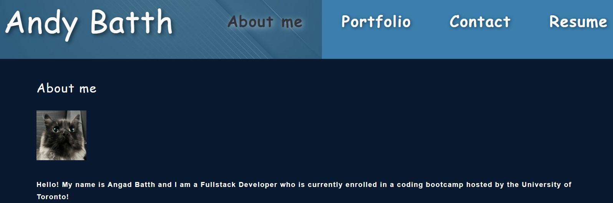

# React-Portfolio

## Table of Contents
- [Description](#description)
- [Installation](#installation)
- [Usage](#usage)
- [Technologies Used](#technologies)
- [License](#license)
 

## Description
This is a Portfolio created using React and gh-pages for deployment! React was used to create a web application with multiple pages for the user to interact with, barring the need to refresh the page.
 

[Link to Deployed Application](https://angadbatth.github.io/portfolio/)  

## Installation
Clone the repository and ensure you have Node.js installed.  
Once you've done that, open the terminal and run `npm install` to install the dependencies.  
Then, run `npm start` to start the application into a local session @ https://localhost:3000/   

## Usage

## Technologies

- VS Code  
- NodeJS  
- Webpack  
- JavaScript  
- React  
- Handlebars  
- gh-pages  

## License
The code in this project is licensed under MIT license.